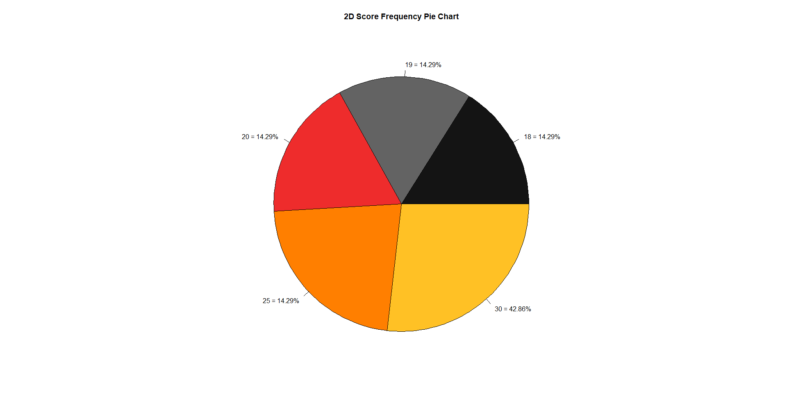
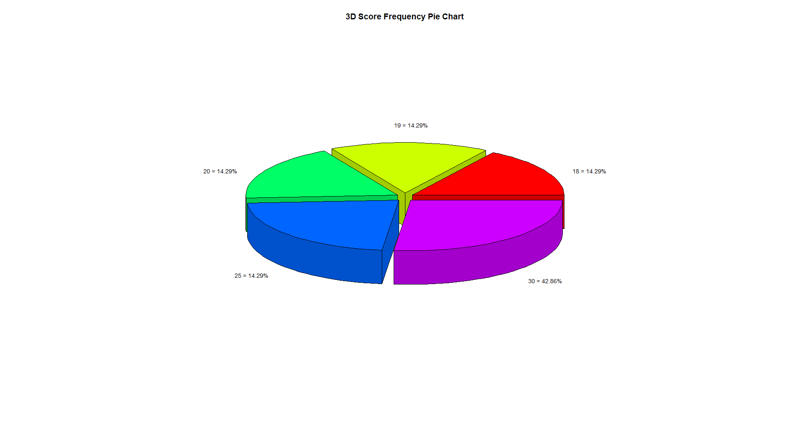

# Exam Statistics with R

This small project was started with the aim of creating useful tools for
the italian university students in order to indicatively calculate
the exams weighted mean and gase graduation score.

**The R scripts** allow to the student *who uses RStudio* to calculate
the **weighted mean, base graduation score** and to show the graphs of the
analyzed data.\
**The spreadsheet** allow to student *who does not use R Studio* to calculate
the **weighted mean and the base graduation score**.

The tools available permit to the student to do
**simulations**.\
To carry out simulations it is possible to insert
**simulated exam scores** in order to verify the
changes that the weighted average undergoes.

## Table of content

* [General info](#general-info)
* [Technologies](#technologies)
* [Setup](#setup)

## General info

The **script [exam_statistics.R](exam_statistics.R)** reads a CSV file
named **[passed_exams.csv](passed_exams.csv)** and placed in the same folder of this
script.\
After running this script it will generate:
- a **spreadsheet-like representation** of the
[passed_exams.csv](passed_exams.csv) CSV file

- a score percentage **2D pie chart**

- A score percentage **3D pie chart**

- A score **frequency histogram**

- An output file named **exam_statistics_output_file.txt** that will be placed
in the same folder of the executed script.\

The **generated graph** will appear in the **RStudio plot section**.

The **CSV file [passed_exams.csv](passed_exams.csv)** must follow a
**specific format**:

- The **firs row** must contain the name of the columns, specifically:
Subject, Score and CFU
- The **first value** is the **row index**, for example *1*
- The **second value** is the **subject name**, for example
*Analisi Matematica(Mathematical Analysis)*
- The **third value** is the score got passing the exam, for example *30*
- The **fourth value** is the number of **CFU(Crediti Formativi Universitari)**
obtained  after passing the exam, for example *12*. **1 CFU** corresponds
to **25 hours of study** including course lessons.

In this CSV file the student must insert the results of passed exams.\
Is it possible to insert a
**simulation of the result of a not yet passed exam**,
this action will provide a simulation on the **change of the weighted mean** of
all exams scores.

The **script [weighted_mean_calculator.R](weighted_mean_calculator.R)** simply
**calculates** and **print on the RStudio console** the **weighted mean**
and the **base graduation score** calculated from the data stored in the **[passed_exams.csv](passed_exams.csv)** file.

The **exam_statistics_spreadsheet** spreadsheet is divided into **3 sections**:

- The **first section** is the **only one that the user must edit** by entering
the information of the exams passed or those whose score you want to simulate
- The **second section** shows the **results** relating to
the **weighted average and at the base graduation score**
- The **third section** shows the count of passed or simulated ecames scores.

The **exam_statistics_spreadsheet** file is provided in  **xlsx and ods**
file format.

**Important notes**:

1. For score insertion regarding "30 con Lode" is important to follow the rules
given by the followed university course.\
In some cases 30L score is equal to 30, 31, 32 or something else.
So be carefull about the 30L related value inserted in the scripts or
spreadsheet in order to calculate the correct results.
2. This results are indicative, they must be used as an approximation of
the results calculated by the university secretariat.\
There may be small variations in the results compared to those calculated by
the university secretariat because of the rules attributed to the 30 cum laude
or because of other special and unique rules used by the university.

## Technologies

- CSV
- R 3.6.2
- RStudio Version 1.2.5033
- Google Sheets

## Setup

The easiest way to run the scripts is to:

1. **Download** the repository
2. **Edit [passed_exams.csv](passed_exams.csv)** file following the
previously described format rules
3. **Open the [exam_statistics.R](exam_statistics.R)** script in RStudio
and **run it**.\
Alternatively, opend the [weighted_mean_calculator.R](weighted_mean_calculator.R) in
RStudio and run it.

The easiest way to use and preserve the format of the spread sheet is to:

1. **Upload**
the **[exam_statistics_spreadsheet.xlsx](exam_statistics_spreadsheet.xlsx)**
in you Google Drive account **and open it with Google Sheet**
2. **Modify/Edit only the left section of passed/simulated exams** of the
spreadsheet in relation to Subject, Score and CFU columns.\
The spreadsheet does the works for you and it will display the results.

alternatively it is possible to open the spreadsheet using the preferred format
and desktop software, in this case however the preservation of the graphic
aspect of the tables is not guaranteed.
